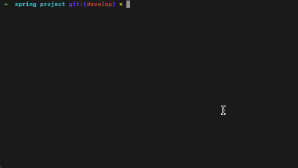

<div align="center">

# Blinder 🛡️

**AI에게 코드 복붙 전, 시크릿만 사라지게.**

[🇰🇷 한국어](./README.md) · [🇺🇸 English](./README_en.md) · [기여 가이드](./CONTRIBUTING.md)

[](https://nodejs.org/)
[](./tsconfig.json)
[](./LICENSE)
[](#-지원-플랫폼--언어)
[](./docs/architecture.md)
[](./docs/commands.md#c-1-blinder-scan----수동-스캔-수정-없음)
[](./CONTRIBUTING.md)


</div>

> **Blinder**는 Cursor / ChatGPT / Claude 같은 AI 에이전트에 코드를 넘기기 전, 소스 속 하드코딩된 API 키·자격증명·인증서가 외부로 유출되는 것을 사전 차단합니다.
>
> 모바일(iOS·Android·Flutter)부터 백엔드(Spring Boot·Node.js·Java·Ruby), 프론트엔드(React/CRA/Vite/Next.js)까지 — **플러그인 아키텍처**로 모든 플랫폼을 커버.

---

## 🚀 Quick Start

```bash
# 1) 글로벌 설치
npm install -g github:YellowC-137/Blinder

# 2) 프로젝트 디렉토리로 이동
cd /path/to/your/project

# 3) AI 공유용 마스킹 사본 생성 (원본 무수정)
blinder mask

# 4) 또는 운영용: 시크릿을 .env로 분리
blinder blind && blinder bridge

# 5) 되돌리기
blinder rollback    # blind 취소
blinder restore     # AI 수정안을 원본에 머지
```

> [!IMPORTANT]
> 어떤 명령이든 실행 **전에 반드시 `git commit`**. Blinder는 빌드 핵심 파일(`build.gradle`, `Podfile`, `Info.plist`, `.pbxproj`)까지 수정합니다.

---



---

## ✨ How it Works

**`blinder blind`** — 운영 코드에서 시크릿을 `.env`로 분리:

```diff
- String apiKey = "sk_live_abc123..."      # Before
+ String apiKey = BuildConfig.STRIPE_KEY   # After (빌드 가능)
```

**`blinder mask`** — AI에 넘길 읽기 전용 사본 생성:

```diff
- apiKey: "AIzaSy9xK2mP3rT..."              # 원본 (유출 위험)
+ apiKey: "__BLINDER_FIREBASE_API_KEY__"    # 마스킹 후 (안전)
```

시크릿 ↔ 토큰 매핑은 사본 **밖** (`<프로젝트 루트>/.blinder_maps/`)에 저장되므로, 마스킹된 사본을 통째로 AI에 공유해도 시크릿이 새어 나가지 않습니다.

> [!IMPORTANT]
> mask를 실행할 경우, build가 불가합니다. AI Agent 읽기전용 프로젝트 생성. 


<details>
<summary><strong>🤔 왜 Blinder인가?</strong></summary>

| 위험 시나리오 | Blinder가 해결하는 방식 |
|---|---|
| 🪣 **`.env`만 빼고 폴더 공유** — 소스 속 하드코딩 키가 그대로 노출 | `blind`가 소스의 평문 키를 `.env`로 분리 + env 접근자로 자동 치환 |
| 🤖 **AI에게 "리팩터링해줘"** — 답변에 키 일부가 그대로 인용되어 외부 학습 데이터로 흘러감 | `mask`가 모든 시크릿을 `__BLINDER_*__` 토큰으로 치환한 **읽기 전용 사본** 생성 |
| 🧨 **빌드 깨짐 우려** — 키를 `.env`로 옮기면 `BuildConfig`/`Info.plist`/`dart-define` 연동을 다 손봐야 함 | `bridge`가 플랫폼별 빌드 시스템 연동을 멱등하게 자동 주입 |
| 🔁 **AI 수정안을 원본에 머지** — 토큰을 다시 시크릿으로 돌리는 작업이 수동/위험 | `restore`가 `.blinder_maps/` 매핑 기반으로 자동 복원 |
| 📦 **사본 통째 공유 시 맵 파일 유출** — 매핑 파일에 원본 시크릿 전체가 들어 있음 | 매핑을 사본 **밖** (`.blinder_maps/`)에 저장 — 사본엔 시크릿 0개 |
| 🚨 **CI/CD에서 사고 차단** | `scan --ci` 비-0 종료 코드로 파이프라인 게이팅 |

</details>

---

## 🧩 지원 플랫폼 / 언어

| 플랫폼 | 카테고리 | 감지 파일 | 스캔 확장자 | 상태 |
|---|---|---|---|:---:|
| **iOS** (Swift / Obj-C) | mobile | `*.xcodeproj`, `Podfile` | `.swift`, `.m`, `.h`, `.plist`, `.xcconfig` | ✅ Stable |
| **Android** (Kotlin / Java) | mobile | `build.gradle`, `AndroidManifest.xml` | `.kt`, `.java`, `.xml`, `.gradle`, `.properties` | ✅ Stable |
| **Flutter** (Dart) | mobile | `pubspec.yaml` | `.dart`, `.yaml` | ✅ Stable |
| **Node.js** | backend | `package.json` (frontend deps 없음) | `.js`, `.mjs`, `.cjs`, `.ts` | ✅ Stable |
| **Java** | backend | `pom.xml` 또는 `src/main/java/` | `.java`, `.properties`, `.xml` | ✅ Stable |
| **Spring Boot** | backend | `pom.xml`(spring-boot-starter) | `.java`, `.kt`, `.properties`, `.yml`, `.xml` | ✅ Stable |
| **React** (CRA / Vite / Next.js) | frontend | `package.json` (`react` deps) | `.js`, `.jsx`, `.ts`, `.tsx` | ✅ Stable |
| **Ruby** | backend | `Gemfile` | `.rb` | ✅ Stable |
| **Common** | core | (모든 프로젝트) | `.env`, `.json` | ✅ Stable |

> 신규 플랫폼 추가 → [Plugin Architecture 가이드](./docs/architecture.md) 또는 [CONTRIBUTING.md](./CONTRIBUTING.md)

---

## 📚 Documentation

| 문서 | 내용 |
|---|---|
| [📋 commands.md](./docs/commands.md) | 전체 명령어 상세 가이드 (`blind`, `mask`, `scan`, `bridge`, `rollback`, `restore`) |
| [⚙️ configuration.md](./docs/configuration.md) | `.blinderSettings` 옵션, 커스텀 패턴, 메타데이터 파일 |
| [🔧 platforms.md](./docs/platforms.md) | 플랫폼별 Auto-fix 예시, 유의사항, 구조화 파일 정책 |
| [🔌 architecture.md](./docs/architecture.md) | 플러그인 아키텍처, IPlatform 인터페이스, 신규 플랫폼 추가 가이드 |

<details>
<summary><strong>❓ FAQ</strong></summary>

**Q. 이미 git에 푸시된 시크릿은?**
Blinder는 현재 워킹 트리 기준. 과거 커밋은 [BFG Repo-Cleaner](https://rtyley.github.io/bfg-repo-cleaner/) + 즉시 시크릿 회전(rotate).

**Q. `blind` 후 빌드가 깨졌어요.**
`blinder bridge` 미실행이 원인. 실행 후에도 깨지면 `blinder rollback`으로 즉시 복구.

**Q. AI 사본(`maskedProject_*`)을 그대로 빌드해도 되나요?**
❌ 절대 안 됩니다. `__BLINDER_*__` 토큰 때문에 컴파일 에러 발생. 사본은 **읽기 전용**.

**Q. CI/CD에 통합하려면?**
```yaml
- name: Scan secrets
  run: npx -y github:YellowC-137/Blinder scan --ci
```

**Q. `.blinder_protect.json` / `.blinder_maps/`를 git에 커밋해야 하나요?**
❌ 모두 `.gitignore`에 자동 추가됨. `restore`/`rollback`이 끝나기 전까지 로컬에서도 절대 삭제 금지.

**Q. 시크릿 매핑 파일은 어디 있나요?**
`<프로젝트 루트>/.blinder_maps/<사본폴더명>.json`. 마스킹 사본 안에는 시크릿이 일절 없으므로 사본 폴더를 통째로 공유해도 안전. (구버전이 사본 안에 만든 `.blinder_map.json`도 `restore`가 자동 인식.)

</details>

<details>
<summary><strong>⚠️ 공통 주의사항</strong></summary>

> [!IMPORTANT]
> **모든 명령 실행 전 `git commit` 필수**: 변경사항 검토 + 즉시 되돌리기 위함.

> [!WARNING]
> **`.env` 파일 관리**: Blinder가 `.gitignore`에 자동 추가하지만, 최종 커밋 전 수동 확인 권장.

> [!CAUTION]
> **이미 노출된 시크릿은 즉시 회전(rotate)**: git 기록 / 백업 / 외부 공유본에 한 번이라도 노출된 키는 무조건 새 키로 교체.

</details>

---

## 🤝 기여하기 · 라이선스

신규 플랫폼 플러그인, 버그 리포트, 문서 개선 모두 환영합니다.

- 🐛 **버그 리포트**: [GitHub Issues](https://github.com/YellowC-137/Blinder/issues)
- 💡 **기능 제안**: [GitHub Discussions](https://github.com/YellowC-137/Blinder/discussions)
- 🔌 **신규 플랫폼 PR**: `blinder add_platform` → 파일 다듬기 → PR → [CONTRIBUTING.md](./CONTRIBUTING.md)

[ISC License](./LICENSE) © Blinder Contributors.
